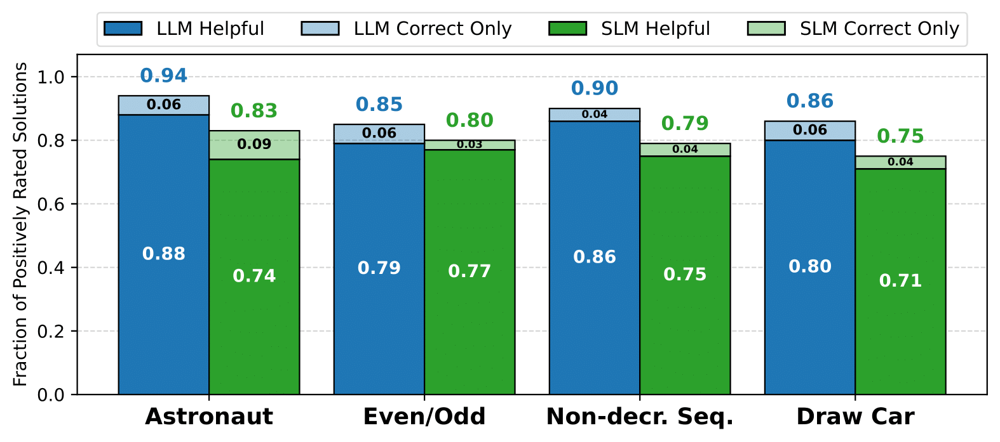

Welcome to the project repository for the **Code In Place AI Evaluation Project (CIP-AIEP)**.  
This project led to the paper:

**Aligning Small Language Models for Programming Feedback:  
Towards Scalable Coding Support in a Massive Global Course**

_To appear in the proceedings of [SIGCSE TS 2026](https://sigcse2026.sigcse.org/), St. Louis, Missouri._

  
  

---

## Summary

- In this project, we trained a **3B-parameter small language model (SLM)** to provide **diagnostic feedback** on students’ submissions to exam-like programming exxercises.
  
- The model was deployed within [Code In Place](https://codeinplace.stanford.edu/), a Massive Open Online Course (MOOC) that teaches thousands of learners worldwide the fundamentals of Python programming.
  
- The model was guided by **rubric-based prompting**, and trained with a combination of supervised fine-tuning, and preference-based optimization.
  
- Feedback quality was judged by **over 50 teaching assistants**.

---

## Highlight

✅ The trained SLM closed the gap to GPT-4.1 from **80% → 10%** on correctness and helpfulness criteria.  

  
  
<em>Trained 3B SLMs approach GPT-4.1 on correctness and helpfulness, while being locally deployable.</em>

---

## Impact

This study is one of the **first deployment of trained SLMs for diagnostic programming feedback in a global MOOC**.  
It demonstrates that small, open-source models can provide **timely, constructive, and scalable feedback**.

---

## Contributors

We thank all the **teaching assistants** who evaluated feedback quality.  The list of full contributors can be found on the [contributors page](https://koutche.me/cip25-aiep/contributors). Special thanks also to the [Code In Place team](https://codeinplace.stanford.edu/team) for supporting the authors during the development of this project. 

**Authors**:  
- [Charles Koutcheme](https://koutche.me/) (Aalto University)  
- [Juliette Woodrow](https://juliettewoodrow.github.io/) (Stanford University)  
- [Chris Piech](https://stanford.edu/~cpiech/bio/index.html) (Stanford University)  
